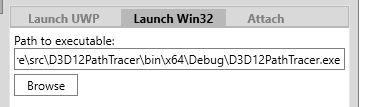
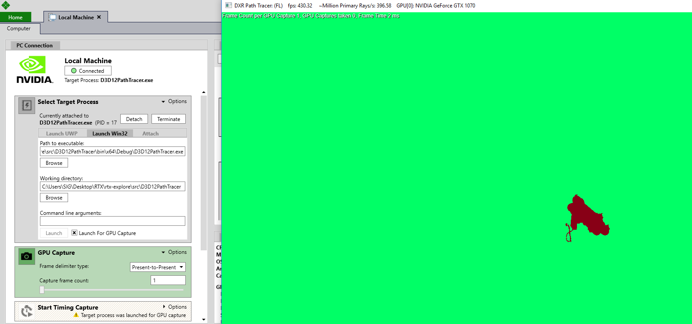
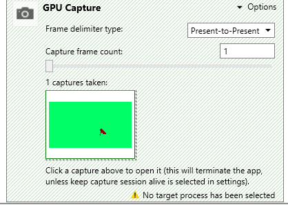
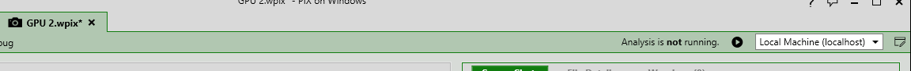

# RTX-Explore - DXR Path Tracer

# Project Goal

  

Our group implemented a Path Tracer that runs on Nvidia's & Microsoft's DirectX Raytracing platform. **Our code does NOT require an actual RTX GPU**. A Shader Model 6.0 (sm 6.0) compatible GPU is enough, given that you import the [fallback layer]().

# Path Tracing Intro

  

Path Tracing is a computer graphics Monte Carlo method of rendering images of three-dimensional scenes such that the global illumination is faithful to reality. In simple terms, a path tracer fires rays from each pixel, which would bounce off in many directions depending on the objects in the scene. If the ray is fortunate enough, it would hit an illuminating surface (lightbulb, sun, etc...), and would cause the first object it hit to be illuminated, much like how light travels towards our eyes.

# Required Build Environment
* Visual Studio 2017 version 15.8.4 or higher.
* [Windows 10 October 2018 (17763) SDK](https://developer.microsoft.com/en-US/windows/downloads/windows-10-sdk)
     * Get the ISO
     * Mount
     * Install all options preferably
* Developer mode enabled on Windows 10

# Building & Running
1) Test that you can run all 3 samples
   * Go to /src
   * Choose one of the sample (HelloTriangle, Procedural, SimpleLighting) and Set as StartUp Project
   * Build and run in Debug/Release mode
      * Make sure that the NuGet package manager can automatically retrieve missing packages. This might require running build twice.
2) TBD

# Debugging the Fallback Layer

### Option 1: Microsoft Pix debugger

[https://blogs.msdn.microsoft.com/pix/download/](https://blogs.msdn.microsoft.com/pix/download/)

Go to the downlaod page and click to download the latest version (in the image below, PIX-1810.24)

Now, once you have it downloaded, run the executable and something like this should show up:

Go to `Launch Win32` tab under Select Target Process

Find the folder that is rtx-explore

In the `Working Directory` line, fill in the line with the rtx-explorer location + `\src\D3D12PathTracer`

`C:\Users\SIG\Desktop\RTX\rtx-explore\src\D3D12PathTracer`

In the `Path to Executable` line, fill in the line with the rtx-explorer location + `\src\D3D12PathTracer\bin\x64\Debug\D3D12PathTracer.exe`

`C:\Users\SIG\Desktop\RTX\rtx-explore\src\D3D12PathTracer\bin\x64\Debug\D3D12PathTracer.exe`

Press Launch, and the application should show up

Now, it's time to mess with Pix!

Press `Print screen` button to capture a frame and `1 captures taken` will appear under `GPU Capture`

Double click the image under `1 captures taken`

Then, a screen will be brought up like below:

Press the `play` button after `Analysis is not running.` at the top right to begin analysis of the frame 

You should get `Analysis is running on NVIDIA ...`, in my case `NVIDIA GeForce GTX 1070`

Now, mess around with pix and take a look at this quick playlist to learn how to debug with PIX 

[Playlist link](https://www.youtube.com/playlist?list=PLeHvwXyqearWuPPxh6T03iwX-McPG5LkB)

### Option 2: Nvidia debugger (RTX only)

[https://developer.nvidia.com/nsight-visual-studio-edition](https://developer.nvidia.com/nsight-visual-studio-edition)

