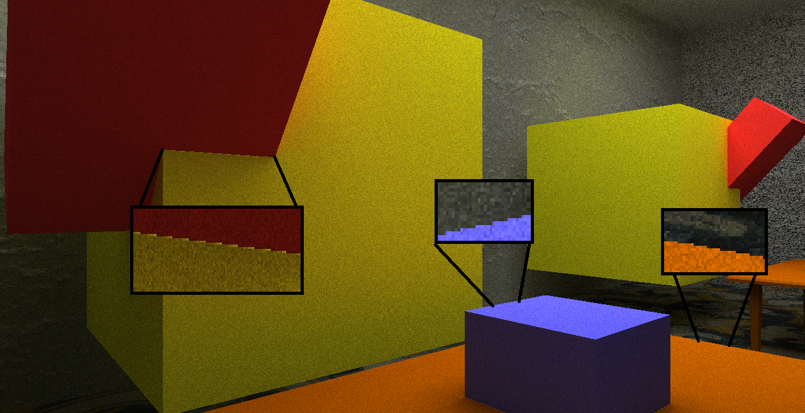
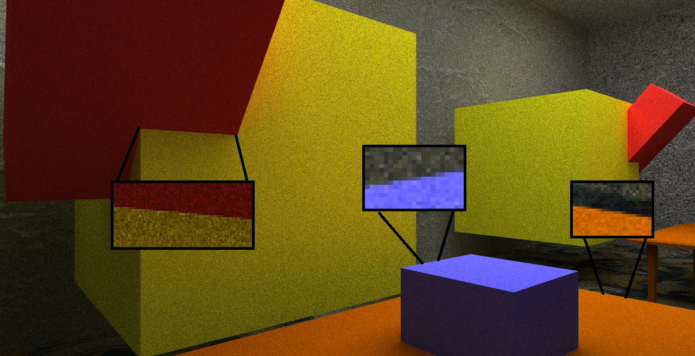
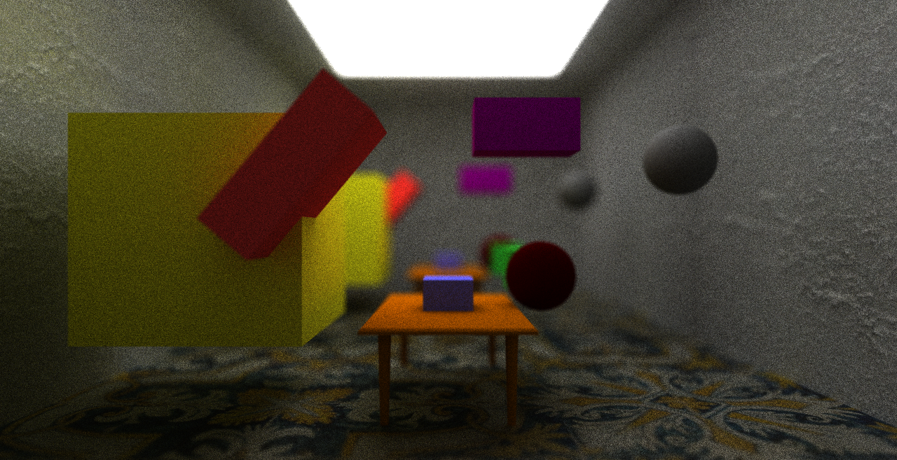

# RTX-Explore - DXR Path Tracer

  <kbd>
  
    </kbd>

        

# Contact Us
* Henry Zhu
  * [LinkedIn](https://www.linkedin.com/in/henry-zhu-347233121/), [personal website](https://maknee.github.io/)
* Liam Dugan
  * [LinkedIn](https://www.linkedin.com/in/liamdugan/), [personal website](http://liamdugan.com)
* Ziad Ben Hadj-Alouane
  * [LinkedIn](https://www.linkedin.com/in/ziadbha/), [personal website](https://www.seas.upenn.edu/~ziadb/)

# Project Goal
With this project, our group planned to leverage the power of Nvidia's & Microsoft's new **DirectX Raytracing** platform to implement a fast Path Tracer. **Our code does NOT require an actual RTX GPU**. A Shader Model 6.0 (sm 6.0) compatible GPU is enough, given that you import the [fallback layer](https://github.com/rtx-on/rtx-explore/blob/master/README.md#building--running).

# Blog Posts for Detailed Explanations
- [Introduction](https://maknee.github.io/dxr/2018/12/06/RTX-DXR-Path-Tracer/)
- [User Guide](https://maknee.github.io/dxr/2018/12/06/RTX-DXR-Path-Tracer-User-Guide/)
- [Host Code Explanation](https://maknee.github.io/dxr/2018/12/07/RTX-DXR-Path-Tracer-Host/)
- [HLSL Shader Code Explanation](https://maknee.github.io/dxr/2018/12/08/RTX-DXR-Path-Tracer-HLSL/)

# Path Tracing Intro

  <kbd>
  
    </kbd>

Path Tracing is a computer graphics Monte Carlo method of rendering images of three-dimensional scenes such that the global illumination is faithful to reality. In simple terms, a path tracer fires rays from each pixel, which would bounce off in many directions depending on the objects in the scene. If the ray is fortunate enough, it would hit an illuminating surface (lightbulb, sun, etc...), and would cause the first object it hit to be illuminated, much like how light travels towards our eyes.

This faithfulness to the physical properties of light allows path tracing to generate significantly more photorealistic images. The difference is particularly noticeable in reflective and refractive surfaces.

  <kbd>
  
    </kbd>

# Features
## Dynamic Loading of Models

### .glTF

  <kbd>
  
  </kbd>

 

### .OBJ
#### Multiple Objects

  <kbd>
  
  </kbd>

 

#### GUI Loader

  <kbd>
  
  </kbd>

 

## Dynamic Loading of Textures & Normal Mapping

    <kbd>
  
  </kbd>

 

## Scene Transformation Tools with GUI

  <kbd>
  
  </kbd>

## Different Materials Support
### Diffuse

    <kbd>
  
  </kbd>

 

### Specular

    <kbd>
  
  </kbd>

 

### Refractive

    <kbd>
  
  </kbd>

 

### Dispersive

    <kbd>
  
  </kbd>

 

### Transmissive

    <kbd>
  
  </kbd>

 

## Subsurface Scattering
### Low Scattering

    <kbd>
  
  </kbd>

 

### High Scattering

    <kbd>
  
  </kbd>

 

## Image Comparison Tool with GUI

    <kbd>
  
  </kbd>

 

## Special Effects
### Anti-Aliasing

| Without Anti-Aliasing | With Anti-Aliasing | 
| ------------- | ----------- |
|  |  |

### Depth of Field
| Without Depth of Field | With Depth of Field | 
| ------------- | ----------- |
|  |  |

# Debug Views
The single most important debug view for a path tracer is a **normal view**. Path tracing is heavily dependent on correct normal representation because of scattering and bouncing. We are working on a toggleable way to switch between views. But for now, we are able to obtain this debug view by simply rendering the absolute value of normals

    <kbd>
  
  </kbd>

 

# Performance Analysis
We tested our DXR Path Tracer in different scenes on different GPUs (GTX 1060, Titan V) and obtained the following results

## Open Scenes vs. Closed Scenes
Given that rays bounce around and terminate when they hit a light source or go off into the void, we tested open scenes and closed scenes separately. Naturally, open scenes performed better. 

    <kbd>
  
  </kbd>

 

## Special Effects On/Off
We tested the effects of having special effects (AA & Depth of Field) on and off. The performance loss is barely noticeable (~ 1 FPS)

    <kbd>
  
  </kbd>

 

## Material Homogeniety
We tested branching in our GPU HLSL code by having a scene with the same type of material and another one with different types of materials. Overall, the homoegenous scene performed better on both GPUs. This is explained by thread divergence in the heterogenous scene, where two rays close to each other migh need to load material data that is not contiguous, making caching ineffective.

    <kbd>
  
  </kbd>

 

## Subsurface Scattering
Subsurface scattering is a technique that causes rays to bounce even more inside materials. This means that rays terminate less often, causing the FPS to drop a bit.

    <kbd>
  
  </kbd>

 

# Required Build Environment
* Shader Model 6.0 support on GPU
* Visual Studio 2017 version 15.8.4 or higher.
* [Windows 10 October 2018 (17763) SDK](https://developer.microsoft.com/en-US/windows/downloads/windows-10-sdk)
     * Get the ISO
     * Mount
     * Install all options preferably
* Developer mode enabled on Windows 10

# Building & Running & Debugging
## Build & Run
1) Test that you can run all 3 samples
   * Go to /src
   * Choose one of the sample (HelloTriangle, Procedural, SimpleLighting) and Set as StartUp Project
   * Build and run in Debug/Release mode
      * Make sure that the NuGet package manager can automatically retrieve missing packages. This might require running build twice.
2) Test that you can run the Path Tracer
   * Make sure that you pass a valid scene file to as an argument
      * Properties > Debugging > Command Line Arguments > "src/scenes/cornell.txt"
## Debug
Check out our short tutorial on [how to use Microsoft PIX](https://github.com/rtx-on/rtx-explore/blob/master/DEBUGGING.md).

## Credits
* Nvidia: The Titan V used for this project was donated by the NVIDIA Corporation. We gratefully acknowledge the support of NVIDIA Corporation with the donation of the Titan V GPU used for this project.
* [TinyObjLoader](https://github.com/syoyo/tinyobjloader) was used to load .OBJ files.
* [TinyGltf](https://github.com/syoyo/tinygltf) was used to load .gltf files.
* Some of [Eren Katsukagi](https://3dtextures.me/)'s textures were used to construct our scenes.
* Some of [Morgan McGuire](https://casual-effects.com/data/)'s models were used to construct our scenes.
* [imgui](https://github.com/ocornut/imgui) was used to generate the GUI for our application.
* [glTF Samples repo](https://github.com/KhronosGroup/glTF-Sample-Models) provided us with nice glTF samples to test in our scenes.

